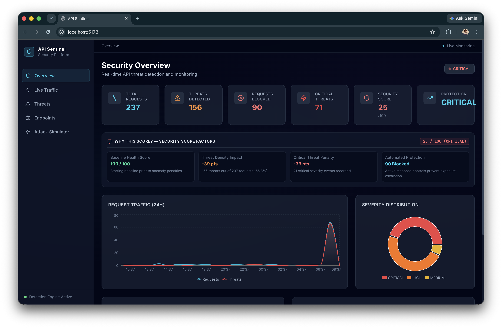
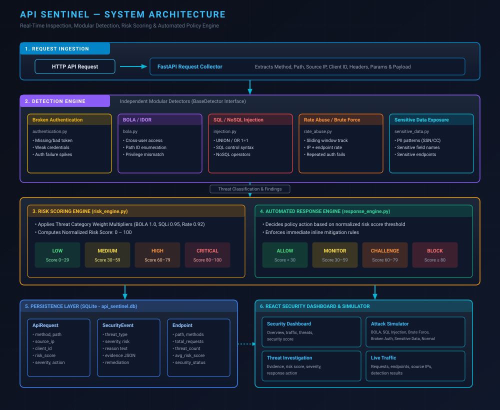
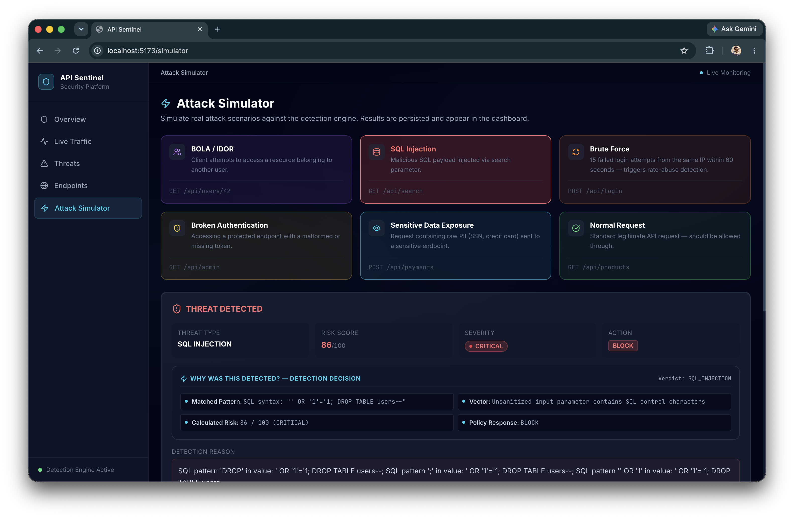
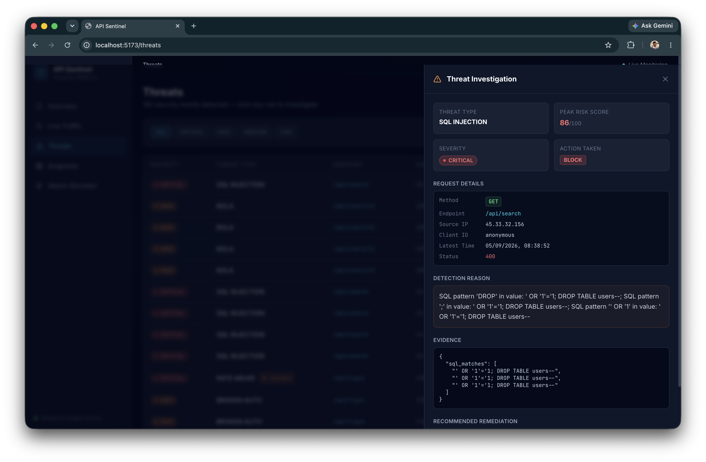

# API Sentinel

> **API Security Detection, Risk Scoring, and Automated Response Platform** — Built for a cybersecurity hackathon demonstration.



---

## 1. Title
**API Sentinel** — Real-Time API Threat Detection & Response Platform

## 2. Description
An end-to-end API security platform that inspects live API traffic, detects threat vectors, calculates real-time risk scores, and triggers automated policy actions.

## 3. Key Features
- **Real-Time Traffic Inspection:** Monitors HTTP methods, endpoints, headers, query parameters, payloads, and client identifiers.
- **Modular Threat Detectors:** 5 independent detection modules covering top OWASP API security risks.
- **Centralized Risk Scoring Engine:** Normalizes threat confidence into a unified 0–100 risk score and severity level.
- **Automated Response Engine:** Executes policy actions (`ALLOW`, `MONITOR`, `CHALLENGE`, `BLOCK`) dynamically.
- **Interactive Attack Simulator:** On-demand execution of real attack vectors with structured "Why Was This Detected?" evidence breakdowns.
- **SOC-Style Security Dashboard:** Dark-mode cybersecurity interface featuring traffic charts, endpoint health posture, grouped incident feeds, and threat investigation drawers.

---

## 4. Problem
Modern applications heavily rely on APIs, making them the primary attack surface for web security breaches. Organizations often lack real-time visibility into API traffic anomalies, leaving critical vulnerabilities like Broken Object Level Authorization (BOLA), SQL Injection, Brute Force attacks, Broken Authentication, and Sensitive Data Exposure undetected until after exfiltration occurs.

---

## 5. Solution
API Sentinel provides an inline security evaluation pipeline that analyzes incoming API requests, scores their threat level, triggers automated mitigation, and visualizes security posture on a SOC dashboard — eliminating manual log parsing and enabling immediate automated response.

---

## 6. Architecture



```
API Request
    ↓
Request Collector (FastAPI Endpoint)
    ↓
Detection Engine (5 Independent Detector Modules)
    ↓
Threat Classification
    ↓
Risk Scoring Engine ──────→ 0–100 Score + Severity Rating
    ↓
Response Engine     ──────→ ALLOW / MONITOR / CHALLENGE / BLOCK
    ↓
SQLite Persistence
    ↓
React SOC Dashboard & Attack Simulator
```

---

## 7. Detection Modules

Each detection module inherits from a clean `BaseDetector` interface and evaluates requests independently:

| Detector Module | Target Threat Category | Key Detection Logic |
|:---|:---|:---|
| `authentication.py` | **Broken Authentication** | Detects missing/malformed bearer tokens, weak default credentials, and authentication failure spikes. |
| `bola.py` | **BOLA / IDOR** | Identifies cross-user resource access attempts, path ID enumeration, and privilege mismatches. |
| `injection.py` | **SQL / NoSQL Injection** | Performs regex pattern matching for SQL syntax, control characters (`UNION`, `OR 1=1`, `--`), and NoSQL operators. |
| `rate_abuse.py` | **Rate Abuse / Brute Force** | Tracks request velocity per IP and endpoint using an in-memory sliding window counter. |
| `sensitive_data.py` | **Sensitive Data Exposure** | Scans request payloads and parameters for PII patterns (SSN, Credit Cards) and exposed sensitive field names. |

---

## 8. Risk Scoring

The Centralized Risk Engine calculates a normalized **0–100 Risk Score** based on detector confidence and threat category weights:

$$\text{Risk Score} = \text{Base Risk} \times \text{Threat Weight}$$

| Score Range | Severity Level |
|:---|:---|
| **80 – 100** | **CRITICAL** |
| **60 – 79** | **HIGH** |
| **30 – 59** | **MEDIUM** |
| **0 – 29** | **LOW** |

---

## 9. Automated Response

The Response Engine maps the calculated Risk Score directly to an automated policy action:

| Action | Score Threshold | System Behavior |
|:---|:---|:---|
| `BLOCK` | **≥ 80** | Request is actively blocked and connection terminated. |
| `CHALLENGE` | **60 – 79** | Requires step-up authentication or CAPTCHA verification. |
| `MONITOR` | **30 – 59** | Request proceeds but is flagged for heightened security logging. |
| `ALLOW` | **< 30** | Request passes cleanly without intervention. |

---

## 10. Attack Simulator
The Attack Simulator enables judges and testers to fire real-world attack scenarios against the live detection pipeline with a single click.



Features:
- **Real Pipeline Execution:** Runs the exact same detection, risk, and response code as live production traffic.
- **Detection Decision Summary:** Displays a structured *"WHY WAS THIS DETECTED?"* breakdown highlighting exact evidence, window sizes, threshold metrics, and payloads.
- **Instant Persistence:** Simulated attacks are saved to SQLite and immediately update dashboard charts, endpoint posture scores, and incident feeds.

---

## 11. Dashboard
Designed with a modern SOC aesthetic:



- **Overview Page:** Real-time protection status, 24h request/threat area chart, severity pie chart, threat type breakdown, recent events feed, and an interactive *"Why this score?"* factor breakdown.
- **Live Traffic Page:** High-density filterable request stream with live auto-refresh toggle.
- **Threats Page:** Threat investigation table that automatically groups repeated Rate Abuse / Brute Force bursts into single consolidated incidents with full drill-down investigation drawers.
- **Endpoints Page:** Complete API catalog listing request volume, threat counts, average risk score, and health status (`HEALTHY`, `AT_RISK`, `CRITICAL`).

---

## 12. Test Results

Verified automated scenario test results across all six simulator scenarios:

| Scenario | Detection | Risk | Severity | Action |
|---|---|---:|---|---|
| BOLA | BOLA | 76.0 | HIGH | CHALLENGE |
| SQL Injection | SQL_INJECTION | 85.5 | CRITICAL | BLOCK |
| Brute Force | RATE_ABUSE | 84.6 | CRITICAL | BLOCK |
| Broken Authentication | BROKEN_AUTH | 31.9 | MEDIUM | MONITOR |
| Sensitive Data | SENSITIVE_DATA | 64.0 | HIGH | CHALLENGE |
| Normal Request | NONE | 0.0 | LOW | ALLOW |

---

## 13. Tech Stack

- **Frontend:** React 18, Vite 5, Tailwind CSS 3, React Router 6, Recharts 2, Lucide React
- **Backend:** Python 3.11+, FastAPI, Uvicorn, Pydantic v2, SQLAlchemy 2
- **Database:** SQLite (file-based, auto-initialized)

---

## 14. Project Structure

```
api-sentinel/
├── backend/
│   ├── app/
│   │   ├── main.py               # FastAPI app entrypoint & lifespan
│   │   ├── config.py             # App environment configuration
│   │   ├── api/
│   │   │   └── routes.py         # REST API route handlers
│   │   ├── database/
│   │   │   ├── connection.py     # SQLAlchemy engine setup
│   │   │   └── seed.py           # Demo dataset seeder (~170 records)
│   │   ├── models/
│   │   │   └── models.py         # ORM models (ApiRequest, SecurityEvent, Endpoint)
│   │   ├── schemas/
│   │   │   └── schemas.py        # Pydantic validation schemas
│   │   ├── services/
│   │   │   ├── detection/        # Independent detector modules
│   │   │   ├── risk_engine.py    # Risk scoring engine
│   │   │   └── response_engine.py# Policy decision engine
│   │   └── utils/
│   └── requirements.txt
├── frontend/
│   ├── src/
│   │   ├── App.jsx               # Navigation layout & routing
│   │   ├── main.jsx
│   │   ├── index.css             # Tailwind & custom dark theme styles
│   │   ├── config/api.js         # API base URL configuration
│   │   ├── services/api.js       # API client wrapper
│   │   ├── components/ui.jsx     # Shared UI components & badges
│   │   └── pages/
│   │       ├── Overview.jsx      # SOC overview dashboard
│   │       ├── LiveTraffic.jsx   # Live request log table
│   │       ├── Threats.jsx       # Threat investigation & grouped incidents
│   │       ├── Endpoints.jsx     # API endpoint health posture
│   │       └── Simulator.jsx     # Interactive attack simulator
│   ├── package.json
│   ├── vite.config.js
│   ├── tailwind.config.js
│   └── .env.example
├── docs/screenshots/             # Screenshot assets placeholder directory
├── .gitignore
└── README.md
```

---

## 15. Setup

### Prerequisites
- Python 3.11+
- Node.js 18+

### 1. Backend Setup
```bash
cd backend

# Create & activate virtual environment
python3 -m venv .venv
source .venv/bin/activate    # On Windows: .venv\Scripts\activate

# Install dependencies
pip install -r requirements.txt

# Launch FastAPI server (database is created and seeded automatically on first startup)
uvicorn app.main:app --reload --port 8000
```
- API Base URL: `http://localhost:8000`
- Interactive Swagger Docs: `http://localhost:8000/docs`

### 2. Frontend Setup
```bash
cd frontend

# Install dependencies
npm install

# Start Vite dev server
npm run dev
```
- Dashboard URL: `http://localhost:5173`

---

## 16. API Endpoints

| Method | Endpoint | Description |
|:---|:---|:---|
| `GET` | `/api/health` | Health check endpoint |
| `GET` | `/api/dashboard/summary` | Aggregated dashboard statistics, charts & score factors |
| `GET` | `/api/requests` | Filterable API request log stream |
| `GET` | `/api/threats` | Filterable security threat events |
| `GET` | `/api/threats/{id}` | Detailed threat evidence & remediation |
| `GET` | `/api/endpoints` | API endpoint health posture catalog |
| `POST` | `/api/simulate` | Executes attack simulation payload |
| `POST` | `/api/analyze` | Analyzes an arbitrary HTTP request payload |

---

## 17. Demo Scenarios

Supported test scenarios for `/api/simulate`:
1. `BOLA` — Cross-user ID access attempt
2. `SQL_INJECTION` — Malicious SQL payload in query string
3. `BRUTE_FORCE` — 15 rapid authentication failures from single IP
4. `BROKEN_AUTH` — Missing/malformed bearer token on protected route
5. `SENSITIVE_DATA` — Raw SSN / Credit Card transmission
6. `NORMAL` — Legitimate GET request

---

## 18. Seeded Demo Data
On initial backend startup, SQLite is automatically seeded with approximately 170 realistic API request records and 90 security events, providing immediate data for dashboard charts and metrics upon launch.

---

## 19. Future Scope
- **Redis-Backed Distributed Rate Limiting:** Replace in-memory sliding window with Redis cluster storage for multi-region deployment.
- **Authentication & RBAC:** Implement JWT user authentication and role-based access control for SOC analysts.
- **ML / Behavioral Anomaly Detection:** Incorporate unsupervised machine learning models to detect zero-day API abuse patterns.
- **API Gateway Integration:** Deploy as an inline proxy middleware for Kong, AWS API Gateway, or Envoy.
- **Persistent Production Database:** Migrate storage backend from SQLite to PostgreSQL / TimescaleDB.
- **SIEM / SOC Integrations:** Add webhooks and native connectors for Slack, PagerDuty, Datadog, and Splunk alerting.

---

## 20. Limitations / Notes
- Designed as a functional prototype for hackathon demonstration.
- Simulated API traffic is generated locally without external network dependencies.
- Rate Abuse tracking uses an in-process sliding window reset on server restart.
- Data persistence utilizes a local SQLite database (`backend/api_sentinel.db`).
